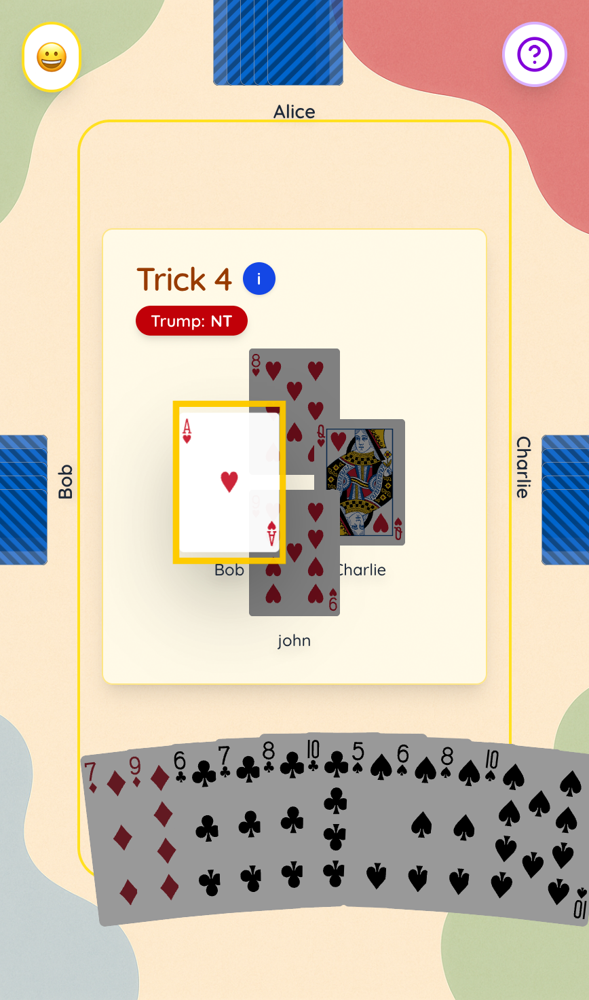

<video
  src="/assets/seven-nt.mp4"
  poster="../../assets/images/seven-nt/seven-nt-landing.png"
  autoplay
  loop
  muted
  playsinline
  preload="metadata"
  style="max-width:100%; border-radius:12px">
</video>

## Where

Play now at [https://seven-nt-bjtjn.ondigitalocean.app/](https://seven-nt-bjtjn.ondigitalocean.app/)

## What

7NT is a 4-player online card game inspired by **[Singaporean Bridge](https://en.wikipedia.org/wiki/Singaporean_bridge)**, a variant of the classic trick-taking game. 

Unlike traditional contract bridge, Singaporean Bridge has a twist: **secret partners**. Players bid, form hidden partnerships, and try to outwit the table through strategy, luck, and a bit of chaos.

For players, it’s a new, cozy, convenient, and exciting way to play the game with friends and chill. For me, it was a sandbox to learn how to design and scale multiplayer systems from scratch.

Also 7NT stands for "seven no trump", which is the highest bid you can ever make in the game.

## Why

Since last year, I ended up playing a lot of Singaporean Bridge with friends in university, sometimes late into the nights. The games were casual, full of banter, laughter and memories, but also at times competitive and engaging.

I wanted to explore if I could **recreate that same chaotic fun online,** but with my own engineering twist.

The goals were threefold:

- **Fun first.** Make a game worth sharing with friends.
- **Tech experiment.** Build and deploy a multiplayer system from scratch.
- **Entrepreneurial spark.** Explore how casual games can attract users and generate engagement.

---

## How It Works 

Though the game itself is simple, the system underneath had to solve some tricky design and technical problems:

- **UI Design**: Comfortable design for players to play on mobile in portrait mode
- **State sync**: Every player needs to see the game update live.
- **Reconnection handling**: If Wi-Fi drops, players can jump back into the game seamlessly.
- **Bot support**: No lobby is ever empty - bots can step in.
- **Analytics**: Track number of visits, bounce rate, session length, and viral growth potential.

Due to timeline constraints, I also had to make some hard decisions to simplify and accelerate the development cycle.

- **No Player Accounts… yet**: I decided to not have player accounts in the initial launch as I expected it would be a roadblock to attracting new players to try out. Also it simplified the development.
- The **entire game state lives in memory for now:** every hand, every trick is tracked in a single game state object. Using services like Redis, or persistence layer like Postgres would have been better. However, I believed in excluding it first on initial launch to focus on implementation, and also to get user feedback faster.

Unlike a simple single-player game, I designed 7NT for **real-time multiplayer scale.** This meant I had to be ready for players joining from flaky Wi-Fi, dropping in and out, with the game state needing to stay consistent across the table. These are some technical details implemented:

- The game runs on a **single Node.js server** (no external persistence layer). I used **Tanstack Start** with its Server Routes to handle both frontend and backend.
- To keep things smooth, I built **polling-based state sync**: clients request fresh state every few seconds, and the server ships back the relevant state
- If a client loses connection, **reconnection handling** kicks in. On reconnect, the server restores the player’s session, resends the current game state, and drops them back into the table seamlessly.
- I experimented with **bots powered by 1) Rule-based and 2) ISMCTS (Information Set Monte Carlo Tree Search)**. These can step in when lobbies aren’t full, though in production I had to exclude ISMCTS bot to reduce compute usage.
- To keep things observable, I integrated **analytics** (via Umami). This tracked bounce rate, session length, and retention, so I could see how real players interacted with the system.

---

## The Journey

My main inspiration came from [Balatro](https://store.steampowered.com/app/2379780/Balatro/) that I was playing a lot at the time. I wanted to emulate its clean user experience.

From there, I came up with

- First prototype: UI screen designs
- Milestones: Game rule implmentation, Multiplayer room system, bot integration, analytics
- Challenges: Building bots, preventing compute hogging from bots and human players
- Alpha test: Received feedbacks about design and bugs

---

## Impact & Lessons Learnt

7NT is still growing. So far we’ve achieved

- 100+ users, 400+ visits

Even in beta, I learned surprising things:

- **Players dropped fast** if they didn’t understand the rules. Added tutorial immediately.
- Most players accessed through **mobile**
- **Reconnection handling** turned out to be essential because people play on unstable mobile connections.

The numbers weren’t huge, but the insights were real: **building games is as much about psychology and business as technology.**

---

## What’s Next / Legacy

I intend to keep the project alive at least until the end of 2025

- Intend to do promotional campaigns
- Solve bugs
- Grow the player base

7NT may not be live forever. But it taught me how to:

- Design multiplayer systems
- Think about viral loops and engagement in product design.
- Ship something fun into the world.

I also hope to share in future the lessons I have learnt in this blog.

---

## Closing Thought

What started out as a simple idea turned out with to be a project spanning few months. But I did learn a lot from this experience. I would like to thank my friends who have helped with testing and gave me precious feedbacks. And of course to the users who have played my game.   

